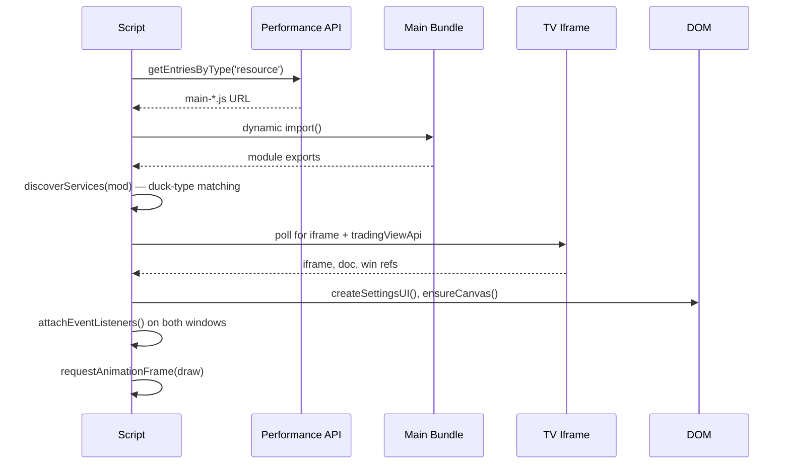
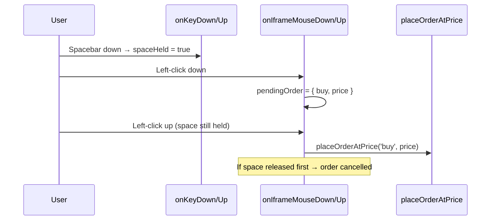

# TradeSea Spacebar Trading — Architecture

> Version 2.2.0 · `tradesea-spacebar.user.js` · ~1500 lines

## Table of Contents

- [Overview](#overview)
- [Script Segments](#script-segments)
- [Data Flow](#data-flow)
- [Key Design Decisions](#key-design-decisions)
- [Pitfalls & Gotchas](#pitfalls--gotchas)
- [Performance Optimizations](#performance-optimizations)
- [Fragile Dependencies](#fragile-dependencies)

---

## Overview

A Tampermonkey/Greasemonkey userscript that injects into TradeSea's trading web app
(`app.tradesea.ai/trade*`). It provides two main features:

1. **Spacebar Quick-Order Mode** — Hold spacebar, left-click = Buy, right-click = Sell.
   Price and order type (Limit vs Stop) are auto-resolved from mouse position relative
   to current market price.

2. **Persistent Price Levels** — Configurable horizontal lines drawn on the chart,
   grouped by instrument, with labels and RGBA colors.

Everything runs in a single IIFE `(function () { ... })()` to avoid polluting globals.

---

## Script Segments

The script is organized into numbered sections, each with a clear responsibility:

```
┌──────────────────────────────────────────────────────────────┐
│ Configuration & Constants         (L13–L29)                  │
│   CONFIG, OrderType, Side enums, logging helpers             │
├──────────────────────────────────────────────────────────────┤
│ State                              (L42–L72)                 │
│   Service references, DOM handles, caches, flags             │
├──────────────────────────────────────────────────────────────┤
│ Persisted Config / Migrations      (L74–L178)                │
│   localStorage R/W, schema versioning (v1→v4), hotkey utils  │
├──────────────────────────────────────────────────────────────┤
│ Break-Even Action                  (L184–L223)               │
│   Move SL to avg entry price via tradingService API          │
├──────────────────────────────────────────────────────────────┤
│ §1 Symbol + Price Helpers          (L225–L321)               │
│   getActiveSymbol, getTickSize, parsePriceLevels, etc.       │
├──────────────────────────────────────────────────────────────┤
│ §2 Coordinate ↔ Price Conversion   (L323–L376)               │
│   coordToPrice (direct API), priceToCoord (interpolated)     │
├──────────────────────────────────────────────────────────────┤
│ §3 Chart Pane / Iframe Rects       (L378–L404)               │
│   getPaneCanvasRect, getIframeRect                           │
├──────────────────────────────────────────────────────────────┤
│ §4 Canvas Overlay                  (L406–L442)               │
│   ensureCanvas, resizeCanvas (fixed position, z-index:10)    │
├──────────────────────────────────────────────────────────────┤
│ §4b Settings UI                    (L444–L825)               │
│   Full modal: contract slots, hotkeys, price level groups    │
├──────────────────────────────────────────────────────────────┤
│ §5 Draw Loop                       (L827–L1153)              │
│   rAF loop → price levels → spacebar crosshair/labels        │
│   Includes: pane caching, overlay masking, multi-pane logic  │
├──────────────────────────────────────────────────────────────┤
│ §6 Order Placement                 (L1155–L1206)             │
│   placeOrderAtPrice → tradingService.placeOrder()            │
├──────────────────────────────────────────────────────────────┤
│ §7 Event Handlers                  (L1208–L1334)             │
│   Keyboard (spacebar, hotkeys), mouse (intent on down,       │
│   fire on up), context menu suppression                      │
├──────────────────────────────────────────────────────────────┤
│ §9 Initialization                  (L1338–L1501)             │
│   Bundle discovery → service introspection → iframe wait →   │
│   config load → event attachment → draw loop start →         │
│   window.tsSpacebar API exposure                             │
├──────────────────────────────────────────────────────────────┤
│ Boot                               (L1503–L1508)             │
│   init() call inside the IIFE                                │
└──────────────────────────────────────────────────────────────┘
```

---

## Data Flow

### Initialization Sequence



### Order Flow (Press & Release)



### Draw Loop (rAF)

```
draw()
  ├─ document.hidden? → skip
  ├─ clearRect
  ├─ Price Levels (always on)
  │   ├─ Throttled: getTvOverlayRects() every ~12 frames
  │   ├─ evenodd clip mask if menus open
  │   ├─ getMatchingPriceLevels() → symbol filter
  │   ├─ getAllPaneRectsForSymbol() → cached 500ms
  │   └─ drawPriceLevels() → dashed lines + right-aligned labels
  │
  └─ Spacebar Crosshair (only when spaceHeld)
      ├─ BUY/SELL labels with order type
      ├─ Lot size indicator
      └─ Yellow LTP reference line
```

---

## Key Design Decisions

### Why a main-document canvas instead of injecting into the iframe?

The TradingView chart lives in a same-origin iframe. We draw on a `<canvas>` in the
**parent document** (z-index: 10, pointer-events: none) because:

- It avoids interfering with TV's internal canvas rendering pipeline
- We can overlay both the chart AND TradeSea's own chrome
- pointer-events: none means we don't block clicks — the iframe still gets all events
- Coordinate translation is just `iframeRect.top/left + paneRect.top/left`

### Why interpolate `priceToCoord` from two samples?

TradingView's embedded widget exposes `coordinateToPrice(y)` on the price scale,
but **not** `priceToCoordinate(price)`. We work around this by:

1. Sampling two fixed Y values (50, 300)
2. Getting their prices via `coordinateToPrice()`
3. Linear-interpolating to find Y for any given price

This is accurate because the price axis is linear for standard chart types.
It would break on **log-scale** charts.

### Why mouseup ordering instead of mousedown?

Prevents accidental orders. The intent is captured on mousedown, but only committed on
mouseup — **if spacebar is still held**. Releasing spacebar before mouse = cancel.
This is critical for a trading tool where every click costs real money.

### Why localStorage with schema versioning?

Config evolves (v1 → v4 so far). Each migration is a `{ fromVersion, toVersion, migrate }`
object. Unknown/too-old configs are reset to defaults rather than corrupting state.
This ensures forward compatibility as features are added.

### Why `discoverServices` via duck-typing?

TradeSea's frontend is a bundled SPA — no stable API surface. We import the main bundle
and scan its exports for objects matching known method signatures:

| Service              | Detection signature                                    |
|----------------------|--------------------------------------------------------|
| `tradingService`     | has `placeOrder()`                                     |
| `accountService`     | has `getCurrentAccount()`                              |
| `symbolService`      | has `getCurrentSymbol()` AND `getTickSize()`            |
| `quantityService`    | has `getQuantity()` AND `setQuantity()`                 |
| `positionService`    | has `getPositions()` AND `getPositionBySymbol()`        |
| `instrumentService`  | has `getInstrumentBySymbol()` AND `getSelectedInstrument()` |

This is fragile but works because the bundle is a Vite build with predictable export
patterns. A TradeSea refactor could break detection.

---

## Pitfalls & Gotchas

### 1. Cross-window event handling

Events must be registered on **both** the main window and the iframe window:
- **Spacebar**: main window `keydown/up` with `capture: true` (works even when
  iframe has focus because events propagate through the capture phase)
- **Mouse**: iframe window only (mouse coordinates are iframe-relative)

If you only listen on the main window, keyboard events work but mouse events don't.
If you only listen on the iframe, spacebar doesn't fire when the iframe doesn't have focus.

### 2. Coordinate system mismatch

There are three coordinate systems in play:

| System | Origin | Used by |
|--------|--------|---------|
| Main document viewport | window top-left | Canvas drawing |
| Iframe viewport | iframe top-left | Mouse events, getBoundingClientRect inside iframe |
| Pane-local | chart canvas top-left | coordinateToPrice() |

Every coordinate must be carefully translated:
`main-doc Y = iframeRect.top + paneRect.top + paneLocalY`

### 3. TradingView DOM selectors are hashed

TV uses CSS modules with hashed class names (e.g. `menuWrap-abc123`). We use
`[class*="menuWrap"]` substring matching to find menus. This is resilient to hash
changes but could false-positive on similarly named persistent elements.

The current selector list was verified via DOM inspection and filtered to only match
**transient** elements (menus, dialogs, popups — not permanent toolbar items).

### 4. Context menu suppression is aggressive

When spacebar is held, `onContextMenu` calls `preventDefault + stopPropagation +
stopImmediatePropagation`. This completely kills the right-click context menu, which
is intentional (right-click = sell order), but could confuse users who don't realize
spacebar is held.

### 5. Break-even rounding direction matters

When moving SL to break-even:
- **Long positions**: round UP (`Math.ceil`) → ensures SL is at or above avg price
- **Short positions**: round DOWN (`Math.floor`) → ensures SL is at or below avg price

Rounding the wrong way would set the stop on the wrong side of the entry.

### 6. Settings overlay blocks all hotkeys

When the settings modal is open (`settingsOverlay !== null`), `onKeyDown` returns
immediately. This prevents accidental orders while configuring, but also means
spacebar won't work until the modal is closed.

### 7. Price level instrument matching is fuzzy

`getMatchingPriceLevels()` uses bidirectional `includes()`:
```js
normSym.includes(inst) || inst.includes(normSym)
```

This means "NQ" matches "MNQ" and vice versa. This is intentional (one set of levels
for NQ and MNQ) but could surprise users if they have unrelated instruments with
overlapping names.

---

## Performance Optimizations

### Active optimizations

| Optimization | What it avoids | Mechanism |
|---|---|---|
| **Overlay rect throttle** | 9× `querySelectorAll` across iframe boundary per frame | Frame counter, refresh every ~12 frames (~200ms) |
| **Pane rect cache** | `getBoundingClientRect` + chart API calls per frame | TTL-based cache (500ms), invalidated on resize |
| **Tab visibility gate** | Entire draw loop when tab is hidden | `document.hidden` check at top of `draw()` |

### By design

- **Canvas `pointer-events: none`** → zero impact on main page interactivity
- **`evenodd` clipping only when menus detected** → no clip overhead 99% of the time
- **Price levels skip drawing when no groups match** → early return in `drawPriceLevels()`
- **`setLineDash([])` reset** → prevents stale dash patterns leaking between draw calls

### Potential future optimizations (not implemented)

- Cache `getMatchingPriceLevels()` result (invalidate on config save + symbol change)
- Pre-compute label text widths via `measureText()` at config save time
- Reduce `getAllPaneRectsForSymbol` DOM queries by caching container elements

---

## Fragile Dependencies

These are the things most likely to break if TradeSea or TradingView update:

| Dependency | Risk | Mitigation |
|---|---|---|
| `iframe.contentWindow.tradingViewApi` | TV widget API surface | Poll with retries at init |
| `chart.getPanes()[0].getMainSourcePriceScale()` | Internal TV method | Fallback chain: main → right → left scale |
| `.chart-container`, `.chart-gui-wrapper` | CSS class names | TV uses stable semantic names (low risk) |
| `performance.getEntriesByType('resource')` → `main-*.js` | Bundle filename pattern | Vite hashes change on rebuild (pattern stable) |
| Service duck-typing (`placeOrder`, `getCurrentAccount`, etc.) | Method names in TradeSea bundle | Would fail silently; init logs which services were found |
| `[class*="menuWrap"]` etc. | TV CSS module hashing | Substring match survives hash changes; new overlay types could be missed |
| `localStorage['ts-spacebar-config']` | Schema migrations | Versioned with fallback to defaults on migration failure |
